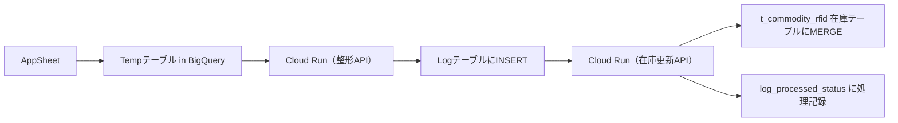

# 📘 README.md

---

## ✅ プロジェクト概要

### 📌 RFID在庫管理システムとは？
このプロジェクトは、AppSheet を入力UIとし、Cloud Run (FastAPI) で受けたデータを整形・在庫テーブル更新するRFID在庫管理基盤です。BigQuery をデータレイヤに活用し、Cloud Scheduler で定期的な同期処理も行います。

---

## 🏗️ 技術構成

| 項目 | 使用技術 |
|------|-----------|
| UI入力 | AppSheet |
| API | FastAPI on Cloud Run |
| データベース | BigQuery |
| 定期処理制御 | Cloud Scheduler |
| 処理記録 | log_processed_status テーブル |

---

## 🔁 処理フロー概要



---

## 📁 ディレクトリ構成

```bash
app/
├── endpoints/
│   ├── picking/
│   ├── receiving/
│   ├── stockhouse/
│   └── rfid/             # 今後追加予定
├── utils/                # 共通処理モジュール
├── config.py             # 環境設定（APIキーなど）
└── main.py               # エントリーポイント

docs/
├── architecture/         # 🔧 全体構成図・連携設計
│   ├── system-overview.md
│   ├── sequence-diagram.md
│   └── data-flow.md
├── backend/              # 🚀 API処理やCloudRun実装系
│   ├── picking.md
│   ├── scheduler.md
│   └── skip_log.md
├── database/             # 🧮 BigQuery・データ構造
│   └── inventory_update.md
├── embedded/             # 📡 RFIDリーダーやRaspberry Pi
│   └── rfid_proxy.md
└── README.md             # ドキュメント全体概要（このファイル）
```

---

## 📘 ドキュメントカテゴリ

| 📂 カテゴリ       | 📄 ドキュメント名          | 📝 説明                                           |
|------------------|----------------------------|--------------------------------------------------|
| **architecture** | `system-overview.md`       | システム構成・主要コンポーネントの概要            |
|                  | `sequence-diagram.md`      | RFID → Cloud Run → BigQuery の一連の流れ         |
|                  | `data-flow.md`             | データの流れと処理順序、重複排除の設計           |
| **backend**      | `receiving.md`             | 受領データ処理、API構成とCloud Run連携           |
|                  | `picking.md`               | ピッキング処理フローと在庫更新の仕組み           |
|                  | `scheduler.md`             | Cloud Scheduler の設計とバッチ処理戦略           |
| **database**     | `inventory_update.md`      | 在庫テーブル更新、重複処理と整合性確保           |
| **embedded**     | `rfid_proxy.md`            | Raspberry Pi等でのLAN受信・バッファ処理           |

---

## 📎 今後の予定

- [ ] `shipping`, `cleaning` 処理系統の追加実装
- [ ] `/docs` 各種テンプレートの整備とCI対応
- [ ] GitHub README にこの内容を転記（GitHub Pages可）

---

## 🧑‍💻 Contributor

- 管理者: `k.nishie`
- サポート: `chatgpt/openai`, BigQuery, Firebase, GCP 各種

---

## 📝 ライセンス
本システムは社内利用目的で設計されたものであり、外部公開の予定は現時点ではありません。

---

（以下は既存構成・コードのリファレンス）

...

（※この下には元の main.py や __init__.py 例を残して問題ありません）
テスト2
