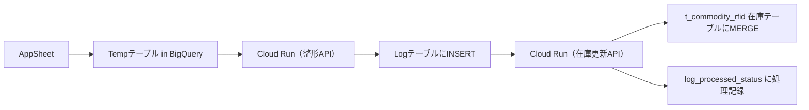

# 📘 README.md

---

## ✅ プロジェクト概要

### 📌 RFID在庫管理システムとは？
このプロジェクトは、AppSheet を入力UIとし、Cloud Run (FastAPI) で受けたデータを整形・在庫テーブル更新するRFID在庫管理基盤です。BigQuery をデータレイヤに活用し、Cloud Scheduler で定期的な同期処理も行います。

---

## 🏗️ 技術構成

| 項目 | 使用技術 |
|------|-----------|
| UI入力 | AppSheet |
| API | FastAPI on Cloud Run |
| データベース | BigQuery |
| 定期処理制御 | Cloud Scheduler |
| 処理記録 | log_processed_status テーブル |

---

## 🔁 処理フロー概要



---

## 📂 ディレクトリ構成

```bash
app/
├── endpoints/
│   ├── picking/
│   ├── receiving/
│   ├── stockhouse/
│   └── rfid/（予定）
├── main.py
├── utils/（共通処理）
├── config.py（環境設定）
docs/
├── architecture.md
├── picking.md
├── receiving.md
├── inventory_update.md
├── scheduler.md
└── README.md
```

---

## 📘 ドキュメント一覧

| ドキュメント名 | 説明 |
|----------------|------|
| architecture.md | システム全体構成の説明 |
| picking.md | Picking工程の整形処理と在庫更新仕様 |
| receiving.md | Receiving工程の処理内容 |
| inventory_update.md | 在庫テーブルへの反映方式、重複防止ロジックなど |
| scheduler.md | Cloud Scheduler による実行タイミングと設計方針 |

---

## 📎 今後の予定

- [ ] `shipping`, `cleaning` 処理系統の追加実装
- [ ] `/docs` 各種テンプレートの整備とCI対応
- [ ] GitHub README にこの内容を転記（GitHub Pages可）

---

## 🧑‍💻 Contributor

- 管理者: `k.nishie`
- サポート: `chatgpt/openai`, BigQuery, Firebase, GCP 各種

---

## 📝 ライセンス
本システムは社内利用目的で設計されたものであり、外部公開の予定は現時点ではありません。

---

（以下は既存構成・コードのリファレンス）

...

（※この下には元の main.py や __init__.py 例を残して問題ありません）
テスト2
