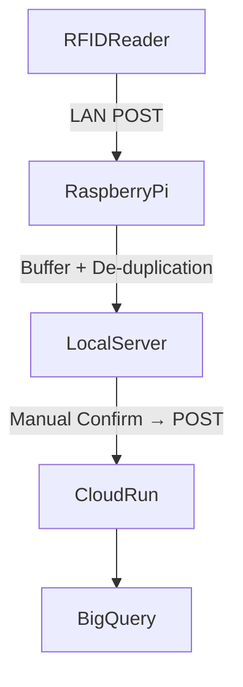

# 📡 RFID Proxy - LAN接続型エッジ受信システム

## 🧭 概要

このドキュメントでは、Raspberry Pi 3 を用いて構築した RFID 中継システムについて説明します。RFIDリーダーからLAN経由で送信されるデータを Raspberry Pi が受信し、データのバッファリング・重複排除を行った上で、Cloud Run 経由で BigQuery に送信します。

---

## 🏗️ システム構成



- **RFID Reader**: TCP/IP通信でJSONデータを送信
- **Raspberry Pi**: Flask or FastAPI サーバーでPOST受信
- **Local Buffer**: 重複を排除してメモリ or ローカルJSONファイルに保持
- **Confirm Trigger**: 確認ボタンでCloud Runに送信

---

## 🔧 ハードウェア要件

| 機材            | 説明                           |
|----------------|--------------------------------|
| Raspberry Pi 3 | 有線LANとWi-Fiを搭載           |
| microSD (16GB+) | OSとPythonコード格納           |
| Optional: SSD  | microSD代替、信頼性強化用       |

---

## 🧪 開発・実行環境

- OS: Raspberry Pi OS Lite（推奨）
- Python: 3.9+
- Flask または FastAPI
- `requests`, `uuid`, `json`, `os`, `dotenv`

---

## 💾 バッファ設計

```python
# 受信データ一時保存バッファ構造
buffer = {
  "E2806915000050219848EE28": {
    "timestamp": "2025-04-07T12:00:00Z",
    "count": 1
  },
  ...
}
```

- **EPCキー**でユニーク化
- **再送抑止**のための一時キャッシュ（TTL方式なども可）
- **送信済みフラグ**を用いてCloud Run送信後にクリア

---

## 🚀 Cloud Run送信ロジック（例）

```python
def send_to_cloudrun(buffered_data):
    url = os.getenv("CLOUD_RUN_RECEIVING_LARGE_ENDPOINT")
    try:
        res = requests.post(url, json=buffered_data, timeout=5)
        if res.status_code == 200:
            print("✅ Cloud Run送信成功")
        else:
            print(f"⚠️ Cloud Run送信失敗: {res.status_code}")
    except Exception as e:
        print(f"❌ 通信エラー: {e}")
```

---

## 📋 今後の改善案

- `SQLite`ベースの簡易DBで永続バッファ管理
- バッファデータの定期自動送信（スケジューラ導入）
- ローカルGUIまたはWebダッシュボードで確認・再送管理
- Cloud Run送信後に成功／失敗ログを記録

---

## 📝 備考

- ラズパイは長期運用を想定して「**電源断でも壊れにくい構成**（例: eMMC or SSD起動）」を推奨
- ネットワーク接続が安定しない場合に備えて **ローカル再送ロジック** を持つ

---

## 📎 関連ドキュメント

- [`system-overview.md`](../architecture/system-overview.md)
- [`data-flow.md`](../architecture/data-flow.md)
- [`receiving.md`](../backend/receiving.md)
